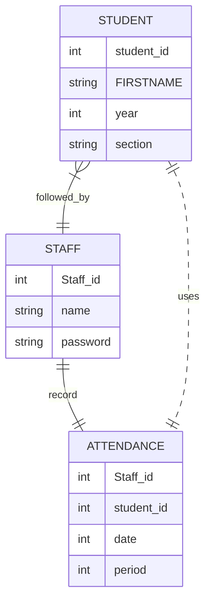

```mermaid
erDiagram
  STUDENT}|--|| STAFF : followed_by
  STAFF ||--|| ATTENDANCE: record
  STUDENT ||..|| ATTENDANCE : uses

  STUDENT{
    int student_id
    string FIRSTNAME
    int year
    string section
  }
  STAFF {
    int Staff_id
    string name
    string password
  
  }
  ATTENDANCE{
    int Staff_id
    int student_id
    int date
    int period
  }

```

`||` means exactly 1 
`}o` and `o{` means 0 or more 
`}|` and `|{` means 1 or more 

Link to mermaid:

https://mermaid.js.org/syntax/entityRelationshipDiagram.html

###
